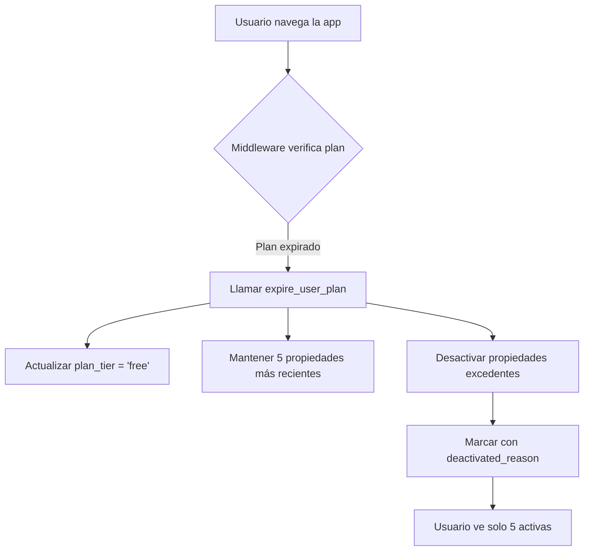
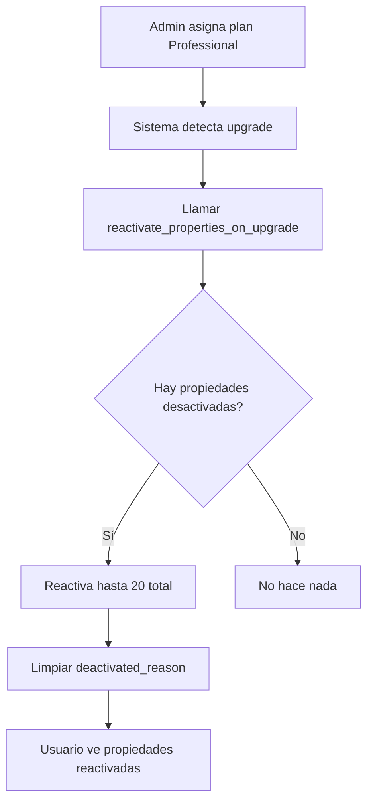

# Sistema de Auto-Expiración de Planes

## 📋 Descripción

Este sistema maneja automáticamente la expiración de planes de inmobiliarias y la desactivación/reactivación de propiedades según los límites del plan.

## ✨ Características

### 1. **Auto-Expiración de Planes**
- Detecta automáticamente cuando un plan expira
- Hace downgrade a plan FREE
- **NO elimina publicaciones**
- Desactiva solo las propiedades que excedan el límite

### 2. **Desactivación Inteligente**
- Mantiene activas las **5 propiedades más recientes**
- Marca las desactivadas con `deactivated_reason = 'plan_downgrade'`
- Registra fecha de desactivación en `deactivated_at`

### 3. **Reactivación Automática**
- Al mejorar el plan, reactiva propiedades automáticamente
- Prioriza las más recientes
- Reactiva hasta el límite del nuevo plan

## 🗄️ Base de Datos

### Nuevas Columnas en `properties`

```sql
ALTER TABLE properties
  ADD COLUMN deactivated_reason VARCHAR(50),
  ADD COLUMN deactivated_at TIMESTAMPTZ;
```

**Valores de `deactivated_reason`:**
- `'plan_downgrade'` - Desactivada por expiración del plan
- `'plan_limit_exceeded'` - Desactivada por exceder límite
- `NULL` - Activa o desactivada manualmente

### Funciones PostgreSQL

#### 1. `expire_user_plan(user_uuid)`
Expira el plan de un usuario y desactiva propiedades excedentes.

**Parámetros:**
- `user_uuid` (UUID) - ID del usuario

**Retorna:**
```typescript
{
  success: boolean
  old_plan: string
  new_plan: string
  properties_deactivated: number
  message: string
}
```

**Ejemplo:**
```sql
SELECT * FROM expire_user_plan('a4ef1f3d-c3e8-46df-b186-5b5c837cc14b');
```

#### 2. `deactivate_excess_properties(user_uuid, max_allowed)`
Desactiva propiedades que excedan el límite.

**Parámetros:**
- `user_uuid` (UUID) - ID del usuario
- `max_allowed` (INTEGER) - Máximo permitido

**Retorna:** Número de propiedades desactivadas (INTEGER)

**Ejemplo:**
```sql
SELECT deactivate_excess_properties('a4ef1f3d-c3e8-46df-b186-5b5c837cc14b', 5);
```

#### 3. `reactivate_properties_on_upgrade(user_uuid, new_max_properties)`
Reactiva propiedades al mejorar de plan.

**Parámetros:**
- `user_uuid` (UUID) - ID del usuario
- `new_max_properties` (INTEGER) - Nuevo límite

**Retorna:** Número de propiedades reactivadas (INTEGER)

**Ejemplo:**
```sql
SELECT reactivate_properties_on_upgrade('a4ef1f3d-c3e8-46df-b186-5b5c837cc14b', 20);
```

#### 4. `expire_all_expired_plans()`
Expira todos los planes vencidos (para cron job).

**Retorna:** Tabla con resultados de cada expiración

**Ejemplo:**
```sql
SELECT * FROM expire_all_expired_plans();
```

## 🔄 Flujo de Funcionamiento

### Escenario 1: Plan Expira Automáticamente



**Ejemplo:**
- Usuario tiene plan Professional (20 propiedades)
- Tiene 15 propiedades activas
- Plan expira el 2025-11-01
- El 2025-11-02, al navegar la app:
  - ✅ Plan cambia a FREE
  - ✅ 5 propiedades más recientes siguen activas
  - ❌ 10 propiedades se desactivan (no se eliminan)

### Escenario 2: Usuario Mejora su Plan



**Ejemplo:**
- Usuario tenía 15 propiedades, 10 desactivadas
- Admin le asigna plan Professional (límite: 20)
- Sistema reactiva automáticamente las 10 desactivadas
- Usuario vuelve a tener 15 propiedades activas

### Escenario 3: Usuario Publica Nueva Propiedad

El sistema verifica límites ANTES de publicar:

```typescript
const planCheck = await enforcePlanLimit(userId, 'create_property')

if (!planCheck.success) {
  return error('Límite de propiedades alcanzado')
}
```

## 🚀 Integración en el Código

### Middleware (Automático)

El middleware verifica la expiración en cada request:

```typescript
// src/middleware.ts
if (user && isAgency && planEndDate < now) {
  await supabase.rpc('expire_user_plan', { user_uuid: user.id })
}
```

**Se ejecuta:**
- ✅ En cada navegación
- ✅ Al hacer login
- ✅ Al acceder a rutas protegidas

### Helper Functions

```typescript
import {
  checkAndExpirePlan,
  reactivatePropertiesOnUpgrade,
  deactivateExcessProperties
} from '@/lib/plan-expiration'

// Verificar y expirar plan
const result = await checkAndExpirePlan(userId)

// Reactiva al mejorar plan
const reactivated = await reactivatePropertiesOnUpgrade(userId, 20)

// Desactivar excedentes
const deactivated = await deactivateExcessProperties(userId, 5)
```

### Al Asignar Plan Manualmente

Cuando un admin asigna un plan:

```typescript
// 1. Actualizar plan en users
await supabase
  .from('users')
  .update({
    plan_tier: 'professional',
    plan_end_date: new Date('2026-11-01')
  })
  .eq('id', userId)

// 2. Reactiva propiedades automáticamente
await reactivatePropertiesOnUpgrade(userId, 20)
```

## 📊 Monitoreo

### Ver Propiedades Desactivadas

```sql
SELECT
  p.id,
  p.title,
  p.deactivated_reason,
  p.deactivated_at,
  u.company_name
FROM properties p
JOIN users u ON p.user_id = u.id
WHERE p.is_active = false
  AND p.deactivated_reason IS NOT NULL
ORDER BY p.deactivated_at DESC;
```

### Ver Planes Próximos a Expirar

```sql
SELECT
  id,
  company_name,
  plan_tier,
  plan_end_date,
  (plan_end_date - NOW()) as time_remaining
FROM users
WHERE plan_tier != 'free'
  AND plan_end_date IS NOT NULL
  AND plan_end_date > NOW()
ORDER BY plan_end_date ASC
LIMIT 10;
```

### Expirar Manualmente un Plan

```sql
SELECT * FROM expire_user_plan('a4ef1f3d-c3e8-46df-b186-5b5c837cc14b');
```

## 🔧 Cron Job (Opcional)

Para ejecutar la expiración de forma programada (diaria a las 00:00):

### Opción 1: pg_cron (Supabase)

```sql
-- Crear cron job para expirar planes
SELECT cron.schedule(
  'expire-plans-daily',
  '0 0 * * *', -- Todos los días a las 00:00
  $$SELECT * FROM expire_all_expired_plans()$$
);
```

### Opción 2: API Route + External Cron

```typescript
// src/app/api/cron/expire-plans/route.ts
export async function GET(request: Request) {
  const authHeader = request.headers.get('authorization')

  // Verificar token secreto
  if (authHeader !== `Bearer ${process.env.CRON_SECRET}`) {
    return NextResponse.json({ error: 'Unauthorized' }, { status: 401 })
  }

  const supabase = createClient()
  const { data, error } = await supabase.rpc('expire_all_expired_plans')

  return NextResponse.json({ data, error })
}
```

Luego configurar en Vercel Cron o similar.

## ⚠️ Consideraciones Importantes

### 1. **NO se eliminan propiedades**
Las propiedades desactivadas permanecen en la base de datos y pueden reactivarse.

### 2. **Prioridad por fecha**
Se mantienen/reactivan las propiedades más recientes primero.

### 3. **Fundadores**
Los fundadores tienen descuento permanente pero su plan FREE inicial también expira. Después del período gratis, pagan 50% del precio.

### 4. **Performance**
Los índices creados aseguran que las queries sean rápidas incluso con muchas propiedades.

## 📝 Checklist de Implementación

- [x] Crear funciones PostgreSQL
- [ ] **Aplicar migración en Supabase Dashboard**
- [x] Integrar en middleware
- [x] Crear helper functions
- [ ] Configurar cron job (opcional)
- [ ] Probar flujo completo

## 🧪 Testing

### Probar Expiración Manual

```sql
-- 1. Crear usuario de prueba con plan expirado
UPDATE users
SET
  plan_tier = 'professional',
  plan_end_date = NOW() - INTERVAL '1 day'
WHERE id = 'USER_ID';

-- 2. Crear 15 propiedades activas

-- 3. Ejecutar función de expiración
SELECT * FROM expire_user_plan('USER_ID');

-- 4. Verificar:
-- - plan_tier cambió a 'free'
-- - Solo 5 propiedades activas
-- - 10 propiedades con deactivated_reason = 'plan_downgrade'
```

### Probar Reactivación

```sql
-- 1. Asignar plan Professional
UPDATE users
SET
  plan_tier = 'professional',
  plan_end_date = NOW() + INTERVAL '1 year'
WHERE id = 'USER_ID';

-- 2. Reactiva propiedades
SELECT reactivate_properties_on_upgrade('USER_ID', 20);

-- 3. Verificar que las 10 propiedades se reactivaron
```

## 📧 Soporte

Si tienes dudas sobre el sistema de expiración:
1. Revisa los logs del middleware
2. Consulta las propiedades desactivadas en la BD
3. Verifica que la migración se aplicó correctamente
