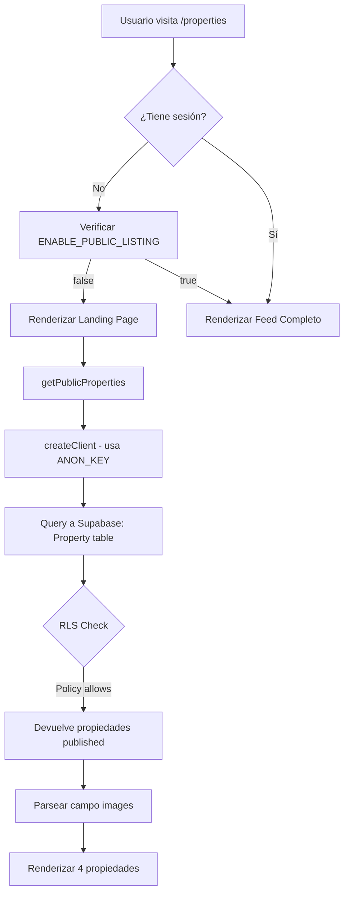

# Implementación de Propiedades Públicas - Landing Page

**Fecha:** 24 de Octubre de 2025
**Versión:** 1.0
**Estado:** ✅ Funcionando en producción

---

## 📋 Índice

1. [Resumen Ejecutivo](#resumen-ejecutivo)
2. [Configuración de Supabase](#configuración-de-supabase)
3. [Configuración de Variables de Entorno](#configuración-de-variables-de-entorno)
4. [Estructura de la Base de Datos](#estructura-de-la-base-de-datos)
5. [Políticas RLS (Row Level Security)](#políticas-rls-row-level-security)
6. [Implementación del Código](#implementación-del-código)
7. [Flujo de Datos](#flujo-de-datos)
8. [Problemas Resueltos](#problemas-resueltos)
9. [Testing](#testing)
10. [Mantenimiento Futuro](#mantenimiento-futuro)

---

## Resumen Ejecutivo

### ¿Qué es?
Landing page pública en `/properties` que muestra propiedades disponibles a usuarios **no autenticados** (anónimos).

### Objetivo
Permitir que visitantes vean propiedades sin necesidad de registrarse, similar a la página `/comunidad`.

### Estado del Feature Flag
- **Variable:** `NEXT_PUBLIC_ENABLE_PUBLIC_LISTING`
- **Valor actual:** `false`
- **Significado:**
  - `false` = Muestra landing page estática para usuarios no logueados
  - `true` = Muestra feed completo a todos (autenticados y anónimos)

---

## Configuración de Supabase

### URL del Proyecto
```
https://qfeyhaaxyemmnohqdele.supabase.co
```

### API Keys Requeridas

#### 1. ANON_KEY (público - para frontend)
```env
NEXT_PUBLIC_SUPABASE_ANON_KEY=eyJhbGciOiJIUzI1NiIsInR5cCI6IkpXVCJ9...
```
- **Rol:** `anon`
- **Uso:** Queries de usuarios no autenticados
- **Acceso:** Controlado por RLS

#### 2. SERVICE_ROLE_KEY (privado - solo backend)
```env
SUPABASE_SERVICE_ROLE_KEY=eyJhbGciOiJIUzI1NiIsInR5cCI6IkpXVCJ9...
```
- **Rol:** `service_role`
- **Uso:** Operaciones administrativas que bypasean RLS
- **⚠️ IMPORTANTE:** Nunca exponer en cliente

### ⚠️ Error Común Resuelto
**Problema:** Ambas keys tenían el mismo valor en Vercel.
**Síntoma:** Requests mostraban `role: service_role` en logs de Supabase cuando deberían mostrar `role: anon`.
**Solución:** Verificar que cada variable tenga su key correcta desde Supabase Dashboard → Settings → API.

---

## Configuración de Variables de Entorno

### Vercel (Producción)
Las siguientes variables DEBEN estar configuradas:

```env
NEXT_PUBLIC_SUPABASE_URL=https://qfeyhaaxyemmnohqdele.supabase.co
NEXT_PUBLIC_SUPABASE_ANON_KEY=eyJ... (clave anon)
SUPABASE_SERVICE_ROLE_KEY=eyJ... (clave service_role)
NEXT_PUBLIC_ENABLE_PUBLIC_LISTING=false
```

### Local (.env.local)
```env
NEXT_PUBLIC_SUPABASE_URL=https://qfeyhaaxyemmnohqdele.supabase.co
NEXT_PUBLIC_SUPABASE_ANON_KEY=eyJ...
SUPABASE_SERVICE_ROLE_KEY=eyJ...
NEXT_PUBLIC_ENABLE_PUBLIC_LISTING=false
```

---

## Estructura de la Base de Datos

### Tabla: `Property`

**Nombre en PostgreSQL:** `"Property"` (con comillas, P mayúscula)

#### Columnas Relevantes

| Columna | Tipo | Descripción | Convención |
|---------|------|-------------|------------|
| `id` | uuid | ID único | camelCase |
| `title` | text | Título de la propiedad | camelCase |
| `status` | text | Estado: 'published', 'suspended', etc. | camelCase |
| `is_active` | boolean | Si está activa | **snake_case** ⚠️ |
| `expires_at` | timestamptz | Fecha de expiración | **snake_case** ⚠️ |
| `propertyType` | text | APARTMENT, HOUSE, COMMERCIAL, etc. | camelCase |
| `operationType` | text | RENT, SALE, BOTH | camelCase |
| `featured` | boolean | Si es destacada | camelCase |
| `images` | text | **JSON string** de array de URLs | camelCase |
| `price` | float | Precio | camelCase |
| `bedrooms` | int | Número de habitaciones | camelCase |
| `bathrooms` | int | Número de baños | camelCase |
| `city` | text | Ciudad | camelCase |
| `province` | text | Provincia | camelCase |
| `createdAt` | timestamptz | Fecha de creación | camelCase |
| `updatedAt` | timestamptz | Última actualización | camelCase |

#### ⚠️ Importante: Convención de Nombres Mixta

La base de datos tiene **MEZCLA de convenciones**:
- **Mayoría:** camelCase (`propertyType`, `createdAt`, `updatedAt`)
- **Excepciones snake_case:** `is_active`, `expires_at`, `updated_at`

**Implicación:** Al hacer queries con Supabase JS, usar el nombre exacto de cada columna.

#### Campo `images` - Formato Especial

```typescript
// En la DB se guarda como STRING:
images: "[\"https://url1.com\",\"https://url2.com\"]"

// Antes de usar, PARSEAR a array:
const imagesArray = JSON.parse(property.images);
```

### Datos de Ejemplo (Producción Actual)

```sql
SELECT id, title, status, is_active, expires_at, featured
FROM "Property"
WHERE status = 'published' AND is_active = true;
```

**Resultado:**
| ID | Title | Status | is_active | expires_at | featured |
|----|-------|--------|-----------|------------|----------|
| 2a685e07... | Departamento 2 dormitorios con balcón y cochera | published | true | 2025-12-19 | false |
| b87dc070... | Casa 3 habitaciones con patio y parrilla | published | true | 2025-12-19 | false |
| 4b1cfd5a... | Casa 2 dormitorios con jardín | published | true | 2025-12-19 | false |
| aac4d405... | Departamento 2 ambientes, céntrico y luminoso | published | true | 2025-12-19 | false |

**Total:** 4 propiedades publicadas actualmente.

---

## Políticas RLS (Row Level Security)

### Estado de RLS
```sql
ALTER TABLE public."Property" ENABLE ROW LEVEL SECURITY;
```

### Políticas Actuales

#### 1. Acceso Público (Usuarios Anónimos)
```sql
CREATE POLICY "Public can view published properties"
ON public."Property"
FOR SELECT
TO anon, authenticated
USING (
  status = 'published'
  AND is_active = true
  AND (expires_at IS NULL OR expires_at > NOW())
);
```

**Permite:**
- Rol `anon` (usuarios no logueados)
- Rol `authenticated` (usuarios logueados)

**Condiciones:**
- Status debe ser `'published'`
- Debe estar activa (`is_active = true`)
- No debe estar expirada

#### 2. Gestión por Propietarios
```sql
CREATE POLICY "Users can manage own properties"
ON public."Property"
FOR ALL
TO authenticated
USING ("userId" = auth.uid()::text);
```

**Permite:** Usuarios autenticados gestionar sus propias propiedades.

### Verificación de RLS

**Test como usuario anónimo:**
```sql
SET ROLE anon;

SELECT COUNT(*)
FROM "Property"
WHERE status = 'published'
  AND is_active = true
  AND (expires_at IS NULL OR expires_at > NOW());

RESET ROLE;
```

**Resultado esperado:** 4 propiedades (según datos actuales).

---

## Implementación del Código

### 1. Página Principal (`src/app/properties/page.tsx`)

#### Función Principal: `getPublicProperties()`

```typescript
async function getPublicProperties() {
  try {
    console.log('[getPublicProperties] START - Fetching properties directly from Supabase...')

    // ✅ CORRECTO: Llamar directamente a Supabase (NO HTTP fetch)
    const supabase = createClient()
    const { data, error } = await supabase
      .from('Property')
      .select('*')
      .eq('status', 'published')
      .eq('is_active', true)
      .order('createdAt', { ascending: false })
      .limit(50)

    if (error) {
      console.error('[getPublicProperties] Supabase error:', error)
      return []
    }

    // ⚠️ IMPORTANTE: Parsear images de JSON string a array
    const processedData = data?.map(property => {
      let images = [];
      try {
        if (typeof property.images === 'string') {
          images = JSON.parse(property.images);
        } else if (Array.isArray(property.images)) {
          images = property.images;
        }
      } catch (e) {
        console.error('[getPublicProperties] Error parsing images:', e);
        images = [];
      }

      return {
        ...property,
        images
      };
    }) || [];

    return processedData
  } catch (error) {
    console.error('[getPublicProperties] CATCH - Error:', error)
    return []
  }
}
```

#### Componente de Página

```typescript
export default async function PropertiesPage() {
  const publicListingEnabled = process.env.NEXT_PUBLIC_ENABLE_PUBLIC_LISTING === 'true'

  // Detectar sesión SOLO si feature flag está activado
  let user = null
  if (publicListingEnabled) {
    try {
      const supabase = createClient()
      const { data: { user: authUser } } = await supabase.auth.getUser()
      user = authUser
    } catch (error) {
      console.error('[PropertiesPage] Auth check failed:', error)
      user = null
    }
  }

  // Landing pública (sin sesión) - SOLO SI FEATURE FLAG ESTÁ OFF
  if (!user && !publicListingEnabled) {
    const publicProperties = await getPublicProperties()

    return (
      <main className="min-h-screen bg-gray-50">
        {/* Hero Section */}
        {/* Benefits Cards */}
        {/* Properties Grid */}
      </main>
    )
  }

  // Feed real (usuario logueado O feature flag activado)
  return <PropertiesPageClient isAuthenticated={!!user} userId={user?.id} />
}
```

### 2. API Route (`src/app/api/properties/route.ts`)

**⚠️ NOTA:** Este endpoint existe pero **NO se usa** para el landing page público.

**Razón:** Hacer HTTP fetch desde SSR a la propia API causaba errores 401.

**Solución:** La página llama directamente a Supabase en vez de hacer HTTP fetch.

#### Query del API (para referencia)

```typescript
const nowIso = new Date().toISOString();

let query = supabase
  .from('Property')
  .select('*', { count: 'exact' })
  .eq('status', 'published')
  .eq('is_active', true);
```

**NOTA:** El filtro de `expires_at` fue removido temporalmente para debugging.

### 3. Cliente Supabase (`src/lib/supabase/server.ts`)

```typescript
import { createServerClient } from "@supabase/ssr";
import { cookies } from "next/headers";

export function createServerSupabase() {
  const cookieStore = cookies();
  return createServerClient(
    process.env.NEXT_PUBLIC_SUPABASE_URL!,
    process.env.NEXT_PUBLIC_SUPABASE_ANON_KEY!,  // ✅ Usa ANON_KEY
    {
      cookies: {
        get(name: string) {
          return cookieStore.get(name)?.value;
        },
        // ... manejo de cookies
      },
    }
  );
}
```

---

## Flujo de Datos

### Usuario No Autenticado Visita `/properties`



### Puntos Clave del Flujo

1. **Server-Side Rendering (SSR):** La página se renderiza en el servidor
2. **No hay HTTP fetch:** Se llama directamente a Supabase desde el servidor
3. **RLS aplica:** Supabase valida permisos usando la política de `anon`
4. **Parseo de datos:** Campo `images` se convierte de JSON string a array

---

## Problemas Resueltos

### Problema 1: HTTP 401 en SSR

**Síntoma:**
```
[getProperties] Response status: 401
[getProperties] 401 error, returning empty
```

**Causa Raíz:**
- La página hacía `fetch('https://misiones-arrienda-2-xxx.vercel.app/api/properties')`
- Desde SSR a su propia API
- Fallaba con 401 por contexto de cookies

**Solución:**
```typescript
// ❌ ANTES: HTTP fetch
const properties = await fetchRealProperties({ limit: 50 })

// ✅ DESPUÉS: Query directa a Supabase
const { data } = await supabase.from('Property').select('*')...
```

**Commit:** `29b25a4`

---

### Problema 2: Tabla y Columnas Incorrectas

**Síntoma:**
Query devolvía 0 resultados a pesar de que los datos existían.

**Causa Raíz:**
Código usaba nombres incorrectos:

| Código Original | Nombre Real en DB |
|----------------|-------------------|
| `properties` | `Property` |
| `property_type` | `propertyType` |
| `operation_type` | `operationType` |
| `created_at` | `createdAt` |

**Solución:**
```typescript
// ✅ CORRECTO
.from('Property')
.eq('propertyType', type)
.eq('operationType', operationType)
.order('createdAt', { ascending: false })
```

**Commits:** `718e31c`, `fd99fec`

---

### Problema 3: Status Incorrecto

**Síntoma:**
```sql
.eq('status', 'AVAILABLE')  -- 0 resultados
```

**Datos Reales:**
```sql
SELECT status FROM "Property";
-- Resultado: 'published' (minúscula)
```

**Solución:**
```typescript
.eq('status', 'published')  // ✅ Minúscula
```

---

### Problema 4: Imágenes No Se Mostraban

**Síntoma:**
```
GET /_next/image?url=%5B&w=1080  // %5B = carácter '['
400 Bad Request
```

**Causa Raíz:**
Campo `images` es un **JSON string** pero se usaba directamente como si fuera array.

**Datos en DB:**
```json
images: "[\"https://images.unsplash.com/photo-1522708323590-d24dbb6b0267?w=800\"]"
```

**Solución:**
```typescript
const processedData = data?.map(property => {
  let images = [];
  if (typeof property.images === 'string') {
    images = JSON.parse(property.images);  // ✅ Parsear JSON
  }
  return { ...property, images };
});
```

**Commit:** `cfa7161`

---

### Problema 5: Featured Filter Bloqueaba Todo

**Síntoma:**
```typescript
fetchRealProperties({ limit: 6, featured: true })  // 0 resultados
```

**Causa:**
Las 4 propiedades tienen `featured = false`.

**Solución:**
Remover filtro de `featured`:
```typescript
// ❌ ANTES
fetchRealProperties({ limit: 50, featured: true })

// ✅ DESPUÉS
.from('Property').select('*')  // Sin filtro de featured
```

---

## Testing

### Script de Prueba Local

**Archivo:** `scripts/test-supabase-properties.js`

```bash
node scripts/test-supabase-properties.js
```

**Resultado Esperado:**
```
Test 1 (no filters): 4 properties
Test 2 (status=published): 4 properties
Test 3 (status=published AND is_active=true): 4 properties
✅ SUCCESS: Queries are working correctly!
```

### Endpoint de Debug

**URL:** https://www.misionesarrienda.com.ar/api/properties-debug

**Uso:** Verificar que queries funcionen en producción.

**Resultado Esperado:**
```json
{
  "test1_all": { "count": 4, "length": 4 },
  "test2_published": { "count": 4, "length": 4 },
  "test3_published_active": { "count": 4, "length": 4 }
}
```

### Verificación en Producción

1. **Landing Page:**
   ```
   https://www.misionesarrienda.com.ar/properties
   ```
   Debe mostrar 4 propiedades para usuarios no logueados.

2. **API Direct:**
   ```
   https://www.misionesarrienda.com.ar/api/properties?limit=50
   ```
   Debe devolver JSON con 4 propiedades.

3. **Logs de Supabase:**
   - Ir a Supabase Dashboard → Logs → API
   - Verificar que requests muestren `role: anon`
   - NO debe mostrar `role: service_role` para queries públicas

---

## Mantenimiento Futuro

### Agregar Nueva Propiedad

**SQL para insertar:**
```sql
INSERT INTO "Property" (
  id, title, description, price, bedrooms, bathrooms, area,
  address, city, province, "postalCode", "propertyType",
  status, images, amenities, features, featured, "userId",
  "agentId", is_active, currency, "operationType", country,
  expires_at, "createdAt", "updatedAt"
) VALUES (
  gen_random_uuid(),
  'Casa moderna 4 ambientes',
  'Descripción de la propiedad...',
  850000,
  3,
  2,
  150,
  'Av. Principal 123',
  'Posadas',
  'Misiones',
  '3300',
  'HOUSE',
  'published',  -- ✅ Importante para que aparezca
  '["https://url-imagen.com"]',  -- ✅ Formato JSON string
  '["garage","jardín"]',
  '["moderna","luminosa"]',
  false,  -- featured
  '6403f9d2-e846-4c70-87e0-e051127d9500',  -- userId
  '6403f9d2-e846-4c70-87e0-e051127d9500',  -- agentId
  true,  -- ✅ is_active = true para que aparezca
  'ARS',
  'RENT',
  'Argentina',
  NOW() + INTERVAL '60 days',  -- expires_at
  NOW(),
  NOW()
);
```

### Cambiar Status de Propiedad

```sql
-- Publicar propiedad
UPDATE "Property"
SET status = 'published', is_active = true
WHERE id = 'uuid-aqui';

-- Suspender propiedad
UPDATE "Property"
SET status = 'suspended', is_active = false
WHERE id = 'uuid-aqui';
```

### Modificar Política RLS

**⚠️ CUIDADO:** Modificar políticas RLS afecta acceso de usuarios.

**Ejemplo - Agregar filtro adicional:**
```sql
DROP POLICY IF EXISTS "Public can view published properties" ON public."Property";

CREATE POLICY "Public can view published properties"
ON public."Property"
FOR SELECT
TO anon, authenticated
USING (
  status = 'published'
  AND is_active = true
  AND (expires_at IS NULL OR expires_at > NOW())
  AND price > 0  -- ✅ Nuevo filtro
);
```

**Siempre probar después de modificar:**
```sql
SET ROLE anon;
SELECT COUNT(*) FROM "Property" WHERE status = 'published';
RESET ROLE;
```

### Activar Feed Público Completo

**Cambiar en Vercel:**
```env
NEXT_PUBLIC_ENABLE_PUBLIC_LISTING=true
```

**Efecto:**
- Usuarios no logueados verán el feed completo (como usuarios logueados)
- Landing page estática ya NO se mostrará
- Puede afectar `/comunidad` (verificar antes)

---

## Checklist de Deployment

Antes de modificar propiedades en producción:

- [ ] Verificar variables de entorno en Vercel
- [ ] Verificar que `NEXT_PUBLIC_SUPABASE_ANON_KEY` sea diferente de `SUPABASE_SERVICE_ROLE_KEY`
- [ ] Probar queries localmente con script de prueba
- [ ] Verificar políticas RLS en Supabase
- [ ] Probar endpoint `/api/properties-debug`
- [ ] Verificar que imágenes se parseen correctamente
- [ ] Hacer deploy y probar en incógnito

---

## Contacto y Soporte

**Desarrollador:** Claude (Anthropic)
**Fecha de Implementación:** 24 de Octubre de 2025
**Documentación Actualizada:** 24 de Octubre de 2025

**Archivos Clave:**
- `src/app/properties/page.tsx` - Página principal
- `src/app/api/properties/route.ts` - API endpoint (no usado en SSR)
- `src/lib/supabase/server.ts` - Cliente Supabase
- `scripts/test-supabase-properties.js` - Script de prueba

---

**Fin del documento**
