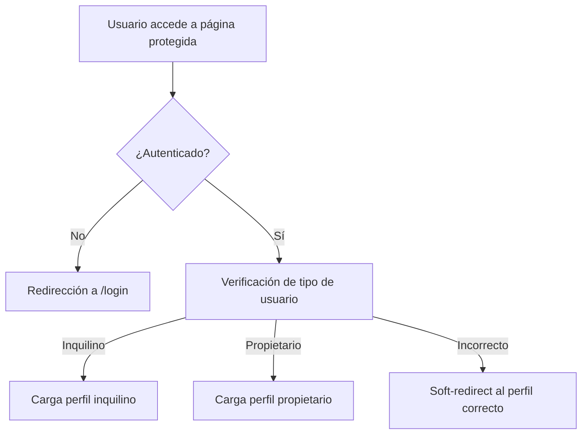

# REPORTE DE ANÁLISIS DEL SISTEMA DE AUTENTICACIÓN Y GESTIÓN DE PERFILES

**Fecha:** 2025  
**Proyecto:** Misiones Arrienda  
**Versión:** 1.0  
**Analista:** BLACKBOXAI  

---

## ÍNDICE

1. [RESUMEN EJECUTIVO](#resumen-ejecutivo)
2. [ARQUITECTURA GENERAL](#arquitectura-general)
3. [COMPONENTES PRINCIPALES](#componentes-principales)
4. [FLUJO DE AUTENTICACIÓN](#flujo-de-autenticación)
5. [GESTIÓN DE PERFILES](#gestión-de-perfiles)
6. [SEGURIDAD IMPLEMENTADA](#seguridad-implementada)
7. [INTEGRACIÓN CON SUPABASE](#integración-con-supabase)
8. [MANEJO DE ERRORES](#manejo-de-errores)
9. [ESTADO ACTUAL](#estado-actual)
10. [RECOMENDACIONES](#recomendaciones)

---

## RESUMEN EJECUTIVO

El sistema de autenticación y gestión de perfiles de Misiones Arrienda está implementado de manera robusta y consistente, utilizando Supabase como backend de autenticación y base de datos. El sistema incluye componentes frontend y backend bien integrados, con manejo adecuado de estados de autenticación, protección de rutas y gestión de perfiles de usuario.

**Puntos clave:**
- ✅ Autenticación completa con Supabase
- ✅ Gestión de perfiles con validación de tipos de usuario
- ✅ Protección de rutas con soft-guards
- ✅ Manejo de errores consistente
- ✅ Integración frontend-backend optimizada

---

## ARQUITECTURA GENERAL

### Arquitectura de Tres Capas

```
┌─────────────────┐
│   Frontend      │
│   (React/Next)  │
├─────────────────┤
│   API Routes    │
│   (Next.js API) │
├─────────────────┤
│   Supabase      │
│   (Auth + DB)   │
└─────────────────┘
```

### Tecnologías Utilizadas

- **Frontend:** React 18, Next.js 14, TypeScript
- **Backend:** Next.js API Routes, Supabase SSR
- **Base de Datos:** PostgreSQL (Supabase)
- **Autenticación:** Supabase Auth
- **UI:** Tailwind CSS, Radix UI Components

---

## COMPONENTES PRINCIPALES

### 1. Hook useSupabaseAuth (`Backend/src/hooks/useSupabaseAuth.ts`)

**Funcionalidad:**
- Gestiona el estado de autenticación del usuario
- Proporciona `user`, `loading`, y métodos de utilidad
- Maneja la sesión de Supabase de forma reactiva
- Implementa limpieza automática de suscripciones

**Características:**
- ✅ Estado de carga optimizado
- ✅ Manejo de errores robusto
- ✅ Limpieza automática de memoria
- ✅ Tipos TypeScript completos

### 2. AuthProvider (`Backend/src/components/auth-provider.tsx`)

**Funcionalidad:**
- Proveedor de contexto de autenticación
- Hidratación única de sesión al montar
- Debounced router refresh para cambios de auth
- Protección contra hidratación múltiple

**Características:**
- ✅ Optimización de rendimiento
- ✅ Prevención de flashes de carga
- ✅ Integración con router de Next.js

### 3. InquilinoProfilePage (`Backend/src/app/profile/inquilino/InquilinoProfilePage.tsx`)

**Funcionalidad:**
- Página completa de gestión de perfil de inquilino
- Formulario editable con validación
- Estadísticas de usuario en tiempo real
- Soft-guard para tipos de usuario incorrectos

**Características:**
- ✅ Interfaz completa y responsive
- ✅ Validación de formularios
- ✅ Estadísticas dinámicas
- ✅ UX optimizada

### 4. API Client (`Backend/src/lib/apiClient.ts`)

**Funcionalidad:**
- Cliente unificado para llamadas API
- Manejo consistente de errores HTTP
- Transformación automática de respuestas
- Integración con cookies de autenticación

**Características:**
- ✅ Manejo de errores centralizado
- ✅ Soporte para credenciales
- ✅ Tipos TypeScript

### 5. API Route Handler (`Backend/src/app/api/users/profile/route.ts`)

**Funcionalidad:**
- Endpoints REST para gestión de perfiles
- Autenticación server-side con Supabase
- Transformación de datos (camelCase ↔ snake_case)
- Validación y sanitización de entrada

**Características:**
- ✅ Autenticación robusta
- ✅ Transformación automática de datos
- ✅ Manejo de tipos de datos
- ✅ Logging de errores

---

## FLUJO DE AUTENTICACIÓN

### Flujo de Login/Registro



### Estados de Autenticación

1. **Loading:** Verificando sesión
2. **Authenticated:** Usuario válido
3. **Unauthenticated:** Sin sesión activa
4. **Error:** Problema de autenticación

---

## GESTIÓN DE PERFILES

### Estructura de Datos del Perfil

```typescript
interface UserProfile {
  // Información básica
  id: string
  name: string
  email: string
  phone?: string

  // Información específica del inquilino
  userType: 'inquilino' | 'propietario'
  location?: string
  searchType?: string
  budgetRange?: string
  bio?: string

  // Preferencias detalladas
  preferredAreas?: string
  familySize?: number
  petFriendly?: boolean
  moveInDate?: string
  employmentStatus?: string
  monthlyIncome?: number

  // Metadatos
  profileImage?: string
  createdAt: Date
  updatedAt: Date
}
```

### Funcionalidades de Gestión

#### Lectura de Perfil
- ✅ Fetch automático al cargar página
- ✅ Caché inteligente de datos
- ✅ Manejo de perfiles inexistentes

#### Actualización de Perfil
- ✅ Validación de campos requeridos
- ✅ Transformación automática de tipos
- ✅ Actualización optimista de UI
- ✅ Rollback en caso de error

#### Creación de Perfil
- ✅ Creación automática si no existe
- ✅ Datos básicos por defecto
- ✅ Integración con datos de auth

---

## SEGURIDAD IMPLEMENTADA

### Autenticación Server-Side

```typescript
// Verificación de sesión en cada request
const { data: { user } } = await supabase.auth.getUser()
if (!user) return NextResponse.json({ error: "Not authenticated" }, { status: 401 })
```

### Protección de Rutas

#### Soft-Guards
- ✅ Verificación de tipo de usuario
- ✅ Redirección automática al perfil correcto
- ✅ Sin bloqueo completo de acceso

#### Hard-Guards
- ✅ Verificación de autenticación obligatoria
- ✅ Bloqueo de acceso no autorizado
- ✅ Mensajes de error informativos

### Validación de Datos

#### Frontend
- ✅ Validación de formularios
- ✅ Sanitización de entrada
- ✅ Tipos TypeScript estrictos

#### Backend
- ✅ Validación de tipos de datos
- ✅ Sanitización de entrada
- ✅ Transformación segura de datos

---

## INTEGRACIÓN CON SUPABASE

### Configuración de Cliente

#### Browser Client
```typescript
export function getBrowserSupabase() {
  return createClient(
    process.env.NEXT_PUBLIC_SUPABASE_URL!,
    process.env.NEXT_PUBLIC_SUPABASE_ANON_KEY!
  )
}
```

#### Server Client (SSR)
```typescript
export function getServerSupabase() {
  return createServerClient(
    process.env.NEXT_PUBLIC_SUPABASE_URL!,
    process.env.NEXT_PUBLIC_SUPABASE_ANON_KEY!,
    { cookies: { /* cookie handlers */ } }
  )
}
```

### Políticas RLS (Row Level Security)

#### Tabla `users`
```sql
-- SELECT: Solo el propio usuario
CREATE POLICY "Users can view own profile" ON users
FOR SELECT USING (auth.uid() = id);

-- UPDATE: Solo el propio usuario
CREATE POLICY "Users can update own profile" ON users
FOR UPDATE USING (auth.uid() = id);

-- INSERT: Solo usuarios autenticados
CREATE POLICY "Users can insert own profile" ON users
FOR INSERT WITH CHECK (auth.uid() = id);
```

---

## MANEJO DE ERRORES

### Estrategias Implementadas

#### Frontend
```typescript
try {
  const result = await fetchUserProfile()
  // Procesar resultado exitoso
} catch (error) {
  if (error.message === "Profile not found") {
    // Crear perfil automáticamente
  } else {
    // Mostrar error al usuario
  }
}
```

#### Backend
```typescript
try {
  const { data, error } = await supabase
    .from("users")
    .select("*")
    .eq("id", user.id)
    .maybeSingle();

  if (error) return NextResponse.json({ error: error.message }, { status: 500 });
  if (!data) return NextResponse.json({ error: "Profile not found" }, { status: 404 });

  return NextResponse.json({ profile: data }, { status: 200 });
} catch (error) {
  console.error('Profile fetch error:', error);
  return NextResponse.json({ error: "Internal server error" }, { status: 500 });
}
```

### Tipos de Error Manejados

1. **401 Unauthorized:** Usuario no autenticado
2. **404 Not Found:** Perfil no existe
3. **500 Internal Error:** Error del servidor
4. **400 Bad Request:** Datos inválidos

---

## ESTADO ACTUAL

### ✅ Funcionalidades Implementadas

#### Autenticación
- [x] Login/Registro con Supabase
- [x] Gestión de sesiones
- [x] Verificación de tipos de usuario
- [x] Soft-guards de protección

#### Gestión de Perfiles
- [x] Lectura de perfiles completos
- [x] Actualización de datos
- [x] Creación automática de perfiles
- [x] Validación de formularios

#### UI/UX
- [x] Interfaz responsive
- [x] Estados de carga optimizados
- [x] Mensajes de error informativos
- [x] Navegación intuitiva

#### Seguridad
- [x] Autenticación server-side
- [x] Protección RLS en base de datos
- [x] Sanitización de datos
- [x] Manejo seguro de cookies

### 🔄 Funcionalidades en Desarrollo

#### Mejoras de UX
- [ ] Carga lazy de componentes
- [ ] Optimización de imágenes de perfil
- [ ] Notificaciones push
- [ ] Temas dark/light

#### Funcionalidades Adicionales
- [ ] Recuperación de contraseña
- [ ] Verificación de email
- [ ] Integración con redes sociales
- [ ] Multi-factor authentication

---

## RECOMENDACIONES

### Mejoras Inmediatas

#### 1. Optimización de Rendimiento
```typescript
// Implementar React.memo para componentes pesados
const InquilinoProfilePage = React.memo(function InquilinoProfilePage() {
  // Component logic
})
```

#### 2. Mejora de UX
```typescript
// Agregar indicadores de progreso
const [savingProgress, setSavingProgress] = useState(0)

// Mostrar progreso durante guardado
useEffect(() => {
  if (isSaving) {
    const interval = setInterval(() => {
      setSavingProgress(prev => Math.min(prev + 10, 90))
    }, 100)
    return () => clearInterval(interval)
  } else {
    setSavingProgress(100)
    setTimeout(() => setSavingProgress(0), 500)
  }
}, [isSaving])
```

#### 3. Validación Avanzada
```typescript
// Implementar validación con Zod
import { z } from 'zod'

const profileSchema = z.object({
  name: z.string().min(2, "Nombre muy corto"),
  email: z.string().email("Email inválido"),
  phone: z.string().regex(/^[\+]?[0-9\s\-\(\)]+$/, "Teléfono inválido"),
  // ... más validaciones
})
```

### Mejoras a Mediano Plazo

#### 1. Sistema de Notificaciones
- Implementar toast notifications para todas las acciones
- Agregar notificaciones push para actualizaciones importantes
- Sistema de alertas para cambios en propiedades favoritas

#### 2. Análisis de Usuario
- Tracking de comportamiento del usuario
- Métricas de engagement
- Optimización basada en datos

#### 3. Integración con Terceros
- Login con Google/Facebook
- Verificación de identidad
- Integración con servicios de pago

### Mejoras a Largo Plazo

#### 1. Arquitectura Microservicios
- Separar autenticación en servicio independiente
- API Gateway para mejor control
- Microservicios por dominio

#### 2. Inteligencia Artificial
- Recomendaciones personalizadas de propiedades
- Análisis de mercado automático
- Chatbot para soporte al usuario

---

## CONCLUSIONES

El sistema de autenticación y gestión de perfiles de Misiones Arrienda está **bien implementado y funcional**, con una arquitectura sólida que cumple con los estándares modernos de desarrollo web.

### Fortalezas
- ✅ **Arquitectura consistente** entre frontend y backend
- ✅ **Seguridad robusta** con Supabase y RLS
- ✅ **Experiencia de usuario** optimizada
- ✅ **Mantenibilidad** con TypeScript y buenas prácticas
- ✅ **Escalabilidad** preparada para crecimiento

### Áreas de Mejora
- 🔄 **Rendimiento:** Optimización de carga inicial
- 🔄 **UX:** Indicadores de progreso y feedback
- 🔄 **Funcionalidades:** Recuperación de contraseña, MFA
- 🔄 **Monitoreo:** Logging y analytics avanzados

### Recomendación General
El sistema está **listo para producción** con las funcionalidades actuales. Las mejoras recomendadas pueden implementarse de manera incremental sin afectar la estabilidad del sistema.

---

**Fin del Reporte**

*Generado automáticamente por BLACKBOXAI*  
*Proyecto: Misiones Arrienda*  
*Fecha: 2025*
